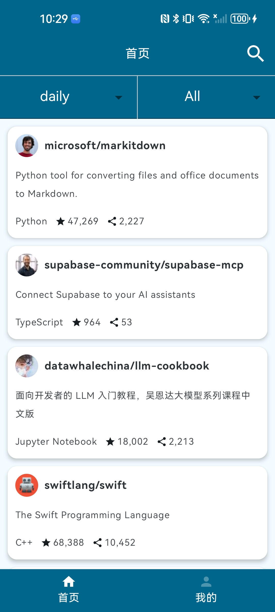
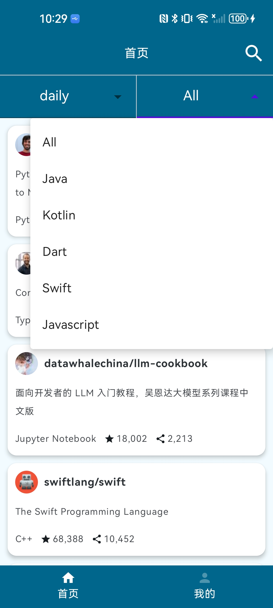
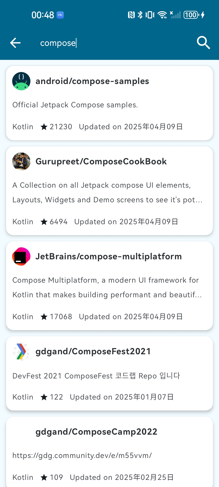
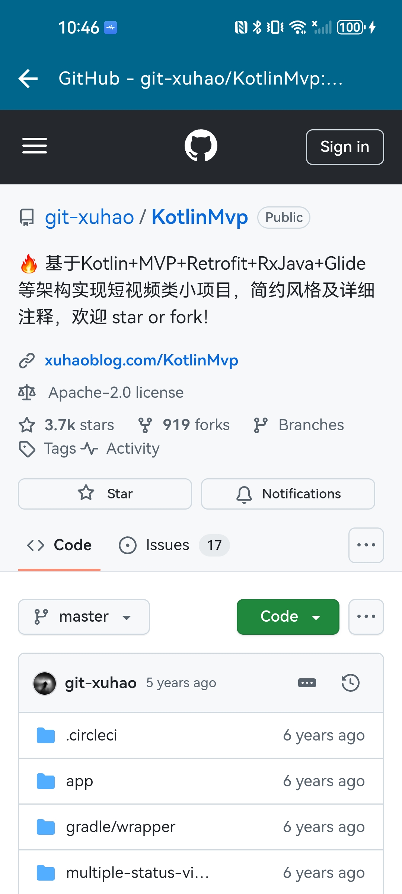
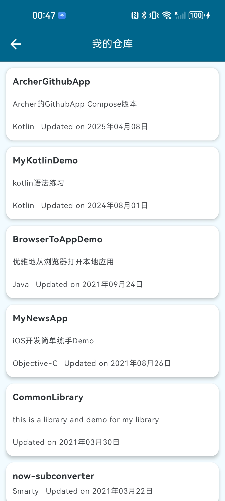
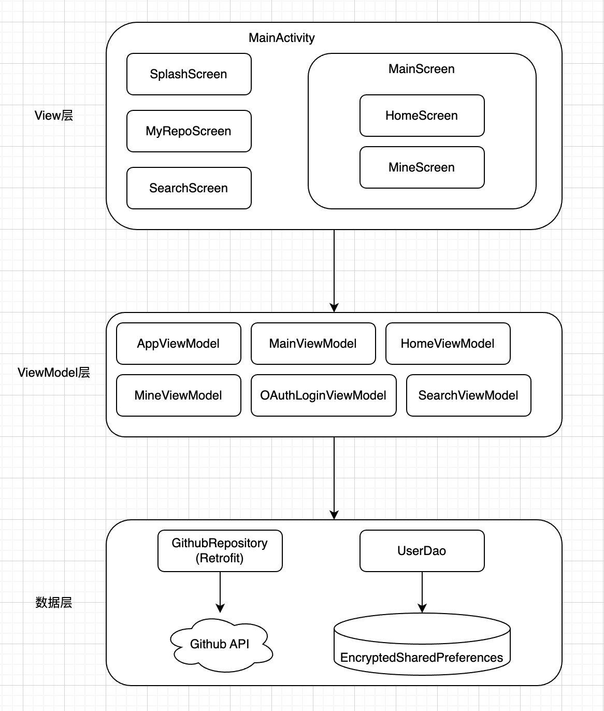

# Compose 版 Github 客户端

## 简介

[ArcherGithubApp](https://github.com/tcgwl/ArcherGithubApp) 采用 `Kotlin` 语言编写，结合 `Jetpack compose` + `MVVM` + `Flow` + `Retrofit` + `Hilt` + `Coil` 等架构设计的开源 Github 客户端 APP。

## 下载体验

- 点击下载 

## 项目截图

|  |  |  |  |
|-------------------------|-------------------------|-------------------------|-------------------------|
|  |  |  |  |

## 项目架构图

## 主要功能

- 首页、我的两个模块；
- 热门仓库，可根据日期和编程语言过滤；
- OAuth登录和退出功能，使用更安全的EncryptedSharedPreferences存储用户token；
- 查看我的所有仓库；
- 搜索功能：目前仅支持Kotlin相关仓库的搜索，支持下拉刷新和上拉加载更多；
- 用WebView查看仓库的详细信息。